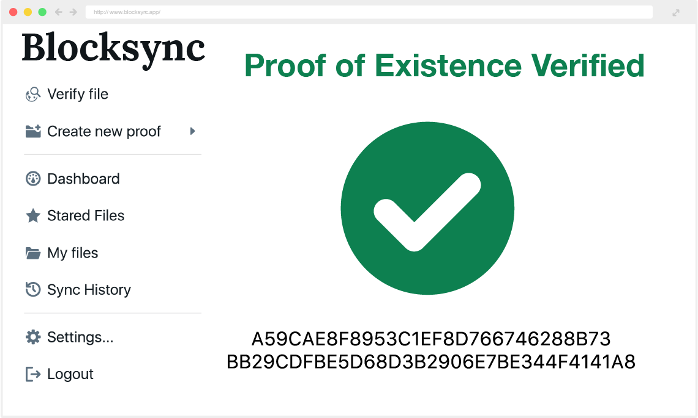

# Notary

Notary automatically includes proof of existance for all of your Dropbox files. Add a file to your Dropbox and it will be included in the Bitcoin blockchain. To make things economical, all of the file hashes are batched and included in a merkle tree. The root of that tree is then included in the blockchain.

This repo includes the frontend, the graphql backend, and the worker jobs. 